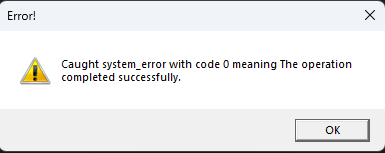

# 🪟 WinAPI Learning Project

A personal sandbox for exploring **WinAPI programming** in **modern C++**.  

The goal is to build native Windows desktop applications from scratch without frameworks, while learning/applying modern C++ practices.

---
## 📚 References

- [WinAPI Programming Tutorial](https://winprog.org/tutorial/)
- [Learn to Program for Windows](https://learn.microsoft.com/en-us/windows/win32/learnwin32/learn-to-program-for-windows)
- [A tour of C++](https://www.stroustrup.com/tour3.html)
- [LearnCPP](https://www.learncpp.com/)
